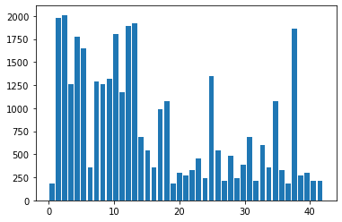
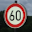
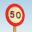

# Project Writeup

# Dataset Exploration

## Dataset Summary

<b> The submission includes a basic summary of the data set. </b>

I was able to explore the dimensions and size of the data provided by using
the numpy and python built-in functions. I was able to determine things like
the length of the data set, the shape of the dataset, and the number of unique
items. Example output can be seen below.

```
Number of training examples = 34799
Number of testing examples = 12630
Image data shape = (32, 32, 3)
Number of classes = 43
```

## Exploratory Visualization

<b> The submission includes an exploratory visualization on the dataset. </b>

I used matplotlib to show me the label distribution of the dataset. This could
help identify which traffic signs may be harder to detect than others.



# Design and Test a Model Architecture

## Preprocessing

<b> The submission describes the preprocessing techniques used and why these
techniques were chosen. </b>

I experimented with a few normalization options such as converting images to
greyscale, applying a gaussian blur, and normalizing the pixel values to a
range of -1 to 1.

I thought the Gaussian blur would help remove potential noise and may
help the model extract more general features from the image. After normalizing
images with this model I found that this did not help.
I converted the

The grayscale helped the model focus more on the features than the colors of
the image. Some of the images with the same label had different colors.

Normalizing pixel values to fall in between -1 and 1 helped give our model a
better starting point because the initial weights didn't have to focus on
normalizing the input data into a range feasible for the activation functions.

I placed all my normalization operations into a single function so I could easily
modify it if I needed. Before training I would always renormalize the data. So any
changes to this would take effect real time.

```python
# common normalization function
def norm(data):
    s1 = normalize_pixels(data)
    s2 = convert_to_greyscale(s1)
    return s2
```


## Model Architecture

<b> The submission provides details of the characteristics and qualities of
the architecture, including the type of model used, the number of layers,
 and the size of each layer. Visualizations emphasizing particular qualities
 of the architecture are encouraged. </b>

 | Layer             | Description                                          |
 |-------------------|------------------------------------------------------|
 |Input              | ? x 32 x 32 x 1 (Grayscale Image)                    |
 |Convolution        | 32 x 32 x 1 -> 28 x 28 x 6                           |
 |Activation         | RELU                                                 |
 |Pooling            | 28 x 28 x 6  -> 14 x 14 x 6                          |
 |Convolution        | 28 x 28 x 6 -> 10 x 10 x 16                          |
 |Activation         | RELU                                                 |
 |Pooling            | 10 x 10 x 16 -> 5 x 5 x 16                           |
 |Flatten            | 400 (5x5x16=400)                                     |
 | Fully Connected   | 400 -> 300                                           |
 | Activation        | RELU                                                 |
 |Fully Connected    | 300 -> 200                                           |
 |Activation         | RELU                                                 |
 |Fully Connected    | 200 -> 43                                            |


## Model Training

 <b> The submission describes how the model was trained by discussing what
 optimizer was used, batch size, number of epochs and values for
 hyperparameters. </b>

 I used the `tf.train.AdamOptimizer` because provided a simple interface to
 apply gradient descent to my model.

 My model was slow to train so I wanted to keep the number of epochs as low
 as possible without underfitting. After a few runs it seemed the max accuracy
 was reached at around 30 epochs.

I kept the batch size at the default of 100 because I was limited on memory.

The learning rate was set to 0.001 because I didn't want my model reacting too
hastily to data, especially since training was occurring in batches that may
be more homogenous that what is ideal.

## Solution Approach

<b> The submission describes the approach to finding a solution. Accuracy on
the validation set is 0.93 or greater. </b>

My final model results were:

- training set accuracy of ?
- validation set accuracy of ?
- test set accuracy of ?


A lot of the modifications done were random trial and error but some of the more
calculated updates were to things like the learning rate, which I could observe
the effects of easier. There were a few instances I set the learning rate too high
and I could see the accuracy jumping back and forth too much.

I also tried to add more weights to the connected layers in hoping it would
allow for more feature detection.

# Test a Model on New Images

## Acquiring New Images

<b> The submission includes five new German Traffic signs found on the web,
and the images are visualized. Discussion is made as to particular qualities
 of the images or traffic signs in the images that are of interest, such as
 whether they would be difficult for the model to classify. </b>

 Here are the 5 images I pulled from the web and why they might be difficult
 to classify

01 & 02 The new depth in color may make these two hard to identify


03 & 04 The angle of the sign in these photos may make them hard to classify




05 The poor quality in this one may make it hard to classify, part of the sign
appears to be jagged.


## Performance on New Images

<b> The submission documents the performance of the model when tested on the
captured images. The performance on the new images is compared to the accuracy
results of the test set. </b>

The model was able to guess 4 of the 5 traffic signs correctly. This did not perform
as well as the test sets but there was little room to fail with such a small
sample size. The incorrect classification did come with the correct answer as
the second most likely classification.

| Expected                     | Actual                                   |
|------------------------------|------------------------------------------|
|Speed limit (70km/h)          | Speed limit (70km/h)                     |
|Keep right                    | Keep right                               |
|Speed limit (60km/h)          | Speed limit (50km/h)                     |
|Speed limit (50km/h)          | Speed limit (50km/h)                     |
|Go straight or right          | Go straight or right                     |

# Model Certainty - Softmax Probabilities

<b> The top five softmax probabilities of the predictions on the captured
 images are outputted. The submission discusses how certain or uncertain the
 model is of its predictions. </b>

 Of the predictions the model got right, the model was greater than 99.98% certain.
 Of the prediction it got wrong, the certainty was split between the first two
 options at 62% and 36%.

 | Expected                     | Actual                                   | Probability |
 |------------------------------|------------------------------------------|-------------|
 |Speed limit (70km/h)          | Speed limit (70km/h)                     | 1.0         |
 |Keep right                    | Keep right                               | 1.0         |
 |Speed limit (60km/h)          | Speed limit (50km/h)                     | .629        |
 |Speed limit (50km/h)          | Speed limit (50km/h)                     | .999        |
 |Go straight or right          | Go straight or right                     | 1.0         |
